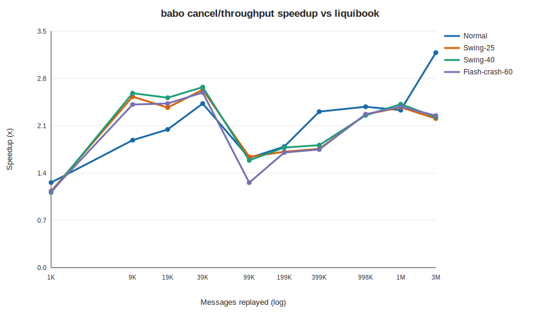
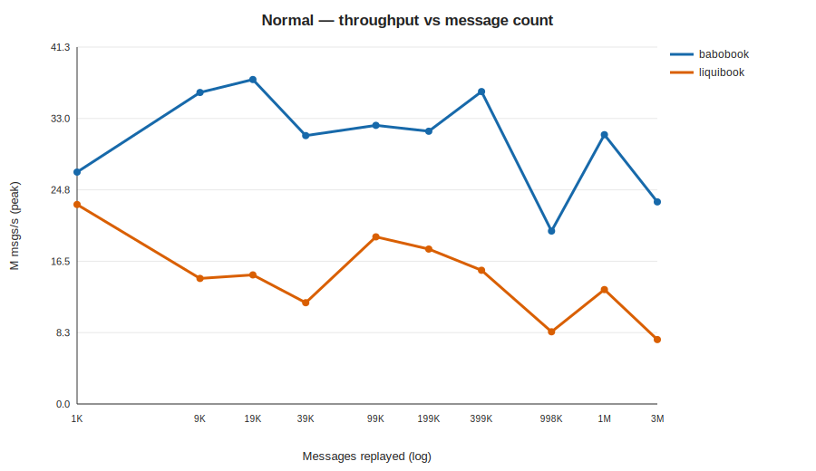
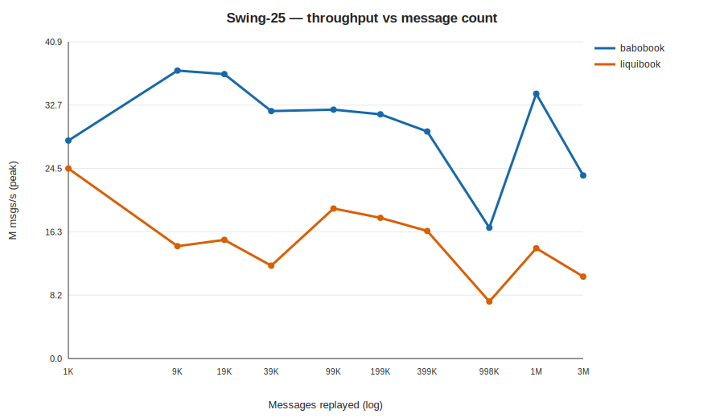
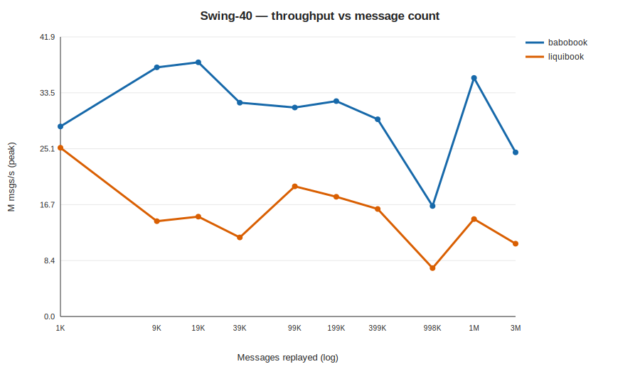
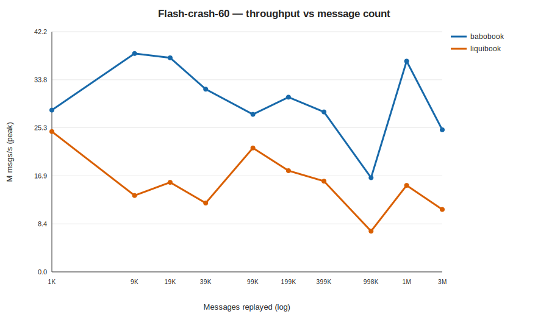

<!-- GENERATED by scripts/run_market_matrix.py; do not hand-edit. -->
# babobook vs liquibook — throughput across market regimes and scale

- **Label:** Darwin-Apple M4 Pro
- **Generated (UTC):** 2026-07-16T15:39:36.390134+00:00
- **CPU / OS:** Apple M4 Pro — macOS-15.6-arm64-arm-64bit
- **RAM / logical CPUs:** 24.0 GiB / 14
- **Compiler:** AppleClang 17.0.0.17000013 · build `Release`
- **Git:** `4ee60763d421accfea21f1003f7acd90002b11c1` (branch `main`, dirty `False`)
- **Protocol:** core-pinned perf binaries, no-op listener; 10 reps per cell, reporting **peak** (per-rep min / best); 1 warmup per cell.
- **Scale:** 1,000, 5,000, 10,000, 20,000, 50,000, 100,000, 200,000, 500,000, 1,000,000, 2,000,000 NEW orders (messages ≈ 2.25×).

## Normal

| NEW orders | Messages | babobook M/s | liquibook M/s | Speedup |
|---:|---:|---:|---:|---:|
| 1,000 | 1,993 | 11.27 | 8.84 | 1.27× |
| 5,000 | 9,983 | 17.48 | 9.15 | 1.91× |
| 10,000 | 19,957 | 25.65 | 12.40 | 2.07× |
| 20,000 | 39,878 | 28.99 | 11.80 | 2.46× |
| 50,000 | 99,955 | 32.56 | 19.81 | 1.64× |
| 100,000 | 199,833 | 32.66 | 18.01 | 1.81× |
| 200,000 | 399,176 | 36.32 | 15.54 | 2.34× |
| 500,000 | 998,097 | 20.23 | 8.39 | 2.41× |
| 1,000,000 | 1,996,097 | 31.89 | 13.52 | 2.36× |
| 2,000,000 | 3,992,943 | 23.79 | 7.39 | 3.22× |

## Swing-25

| NEW orders | Messages | babobook M/s | liquibook M/s | Speedup |
|---:|---:|---:|---:|---:|
| 1,000 | 1,993 | 28.12 | 24.53 | 1.15× |
| 5,000 | 9,983 | 37.16 | 14.51 | 2.56× |
| 10,000 | 19,957 | 36.70 | 15.31 | 2.40× |
| 20,000 | 39,878 | 31.93 | 11.98 | 2.67× |
| 50,000 | 99,955 | 32.12 | 19.35 | 1.66× |
| 100,000 | 199,833 | 31.52 | 18.15 | 1.74× |
| 200,000 | 399,176 | 29.30 | 16.47 | 1.78× |
| 500,000 | 998,097 | 16.88 | 7.36 | 2.29× |
| 1,000,000 | 1,996,097 | 34.18 | 14.23 | 2.40× |
| 2,000,000 | 3,992,943 | 23.62 | 10.57 | 2.23× |

## Swing-40

| NEW orders | Messages | babobook M/s | liquibook M/s | Speedup |
|---:|---:|---:|---:|---:|
| 1,000 | 1,993 | 28.45 | 25.27 | 1.13× |
| 5,000 | 9,983 | 37.31 | 14.27 | 2.61× |
| 10,000 | 19,957 | 38.06 | 14.95 | 2.55× |
| 20,000 | 39,878 | 32.01 | 11.84 | 2.70× |
| 50,000 | 99,955 | 31.30 | 19.48 | 1.61× |
| 100,000 | 199,833 | 32.25 | 17.92 | 1.80× |
| 200,000 | 399,176 | 29.53 | 16.09 | 1.83× |
| 500,000 | 998,097 | 16.54 | 7.25 | 2.28× |
| 1,000,000 | 1,996,097 | 35.73 | 14.59 | 2.45× |
| 2,000,000 | 3,992,943 | 24.58 | 10.90 | 2.25× |

## Flash-crash-60

| NEW orders | Messages | babobook M/s | liquibook M/s | Speedup |
|---:|---:|---:|---:|---:|
| 1,000 | 1,993 | 28.22 | 24.73 | 1.14× |
| 5,000 | 9,983 | 35.08 | 14.36 | 2.44× |
| 10,000 | 19,957 | 38.15 | 15.51 | 2.46× |
| 20,000 | 39,878 | 32.91 | 12.55 | 2.62× |
| 50,000 | 99,955 | 29.11 | 22.88 | 1.27× |
| 100,000 | 199,833 | 31.34 | 18.17 | 1.72× |
| 200,000 | 399,176 | 28.69 | 16.22 | 1.77× |
| 500,000 | 998,097 | 16.74 | 7.28 | 2.30× |
| 1,000,000 | 1,996,097 | 37.04 | 15.36 | 2.41× |
| 2,000,000 | 3,992,943 | 25.66 | 11.27 | 2.28× |

> `M msgs/s` is the peak of 10 reps (matching-core throughput, no report emission). Absolute rates vary by CPU/clock; the **speedup** column is the cross-machine-comparable figure.
