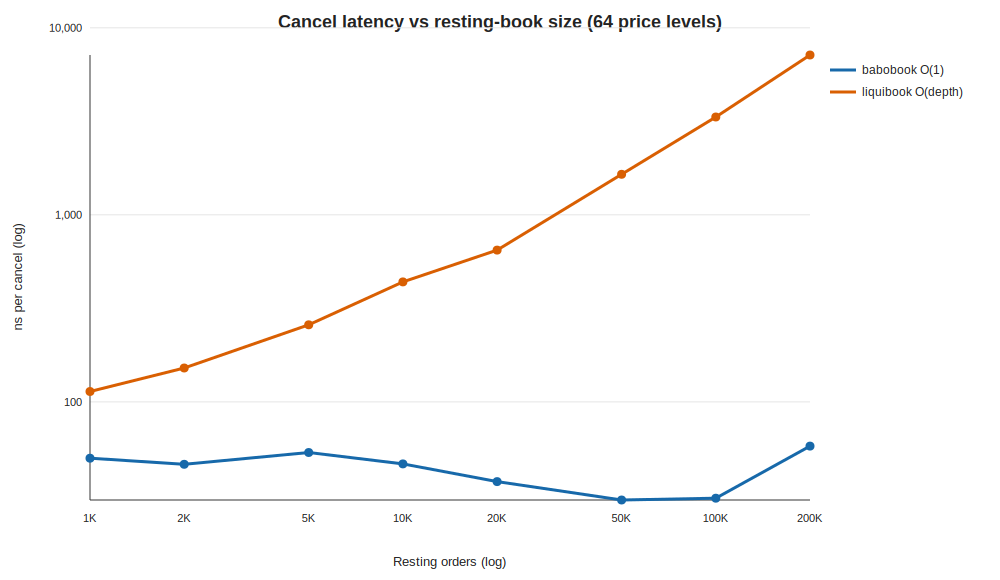

<!-- GENERATED by scripts/run_scaling.py; do not hand-edit. -->
# babobook vs liquibook — cancel latency vs resting-book size

- **Label:** Darwin-Apple M4 Pro
- **Generated (UTC):** 2026-07-16T15:40:27.953436+00:00
- **CPU / OS:** Apple M4 Pro — macOS-15.6-arm64-arm-64bit
- **Logical CPUs / RAM:** 14 / 24.0 GiB
- **Compiler:** AppleClang 17.0.0.17000013
- **CMake build type:** `Release`
- **Git:** `4ee60763d421accfea21f1003f7acd90002b11c1` (branch `main`, dirty `False`)
- **Setup:** 64 price levels; N orders → depth ≈ N/64; cancel all N in a fixed shuffled order; best of 3 reps; prefill off the clock.

| Resting N | Depth/level | babo ns/cancel | liquibook ns/cancel | babo cancel speedup |
|---:|---:|---:|---:|---:|
| 1,000 | 15 | 50.0 | 113.5 | 2.3× |
| 2,000 | 31 | 46.4 | 151.7 | 3.3× |
| 5,000 | 78 | 53.6 | 258.2 | 4.8× |
| 10,000 | 156 | 46.6 | 437.9 | 9.4× |
| 20,000 | 312 | 37.5 | 647.8 | 17.3× |
| 50,000 | 781 | 29.9 | 1646.0 | 55.1× |
| 100,000 | 1,562 | 30.5 | 3333.8 | 109.2× |
| 200,000 | 3,125 | 58.0 | 7153.3 | 123.3× |

> babo cancel is O(1) (id→slot hash index); its gentle rise is cache-hierarchy latency as the working set outgrows L2/L3 — a cost liquibook pays too, on top of its O(depth) `find_on_market` rescan. The speedup column is the money figure.
