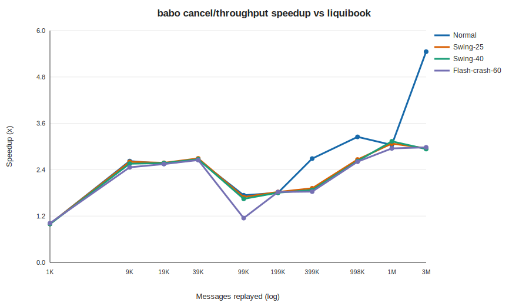
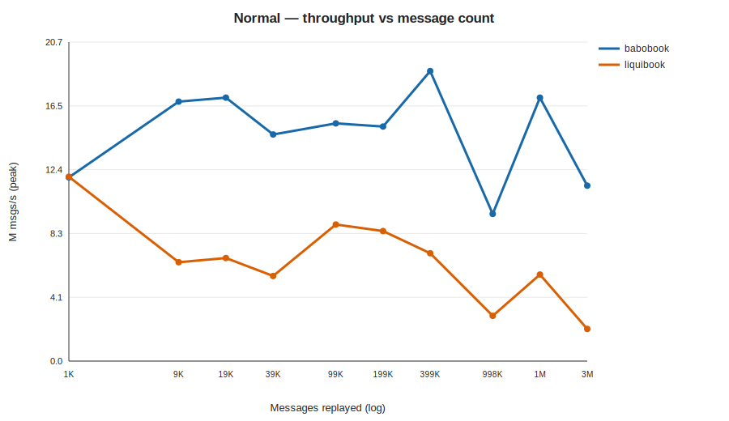
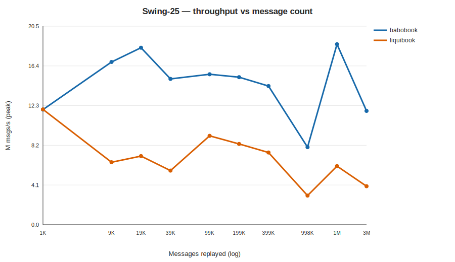
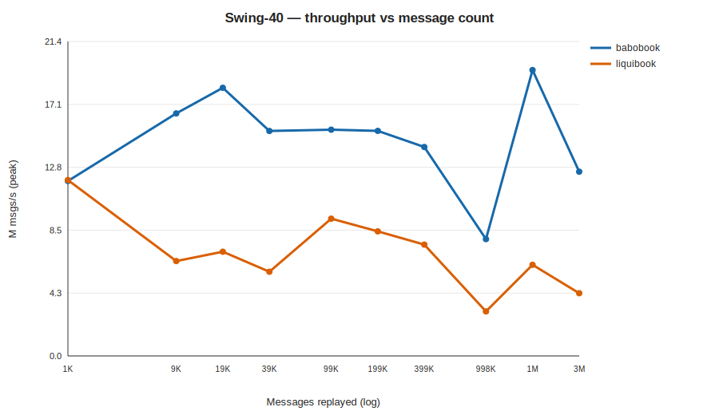
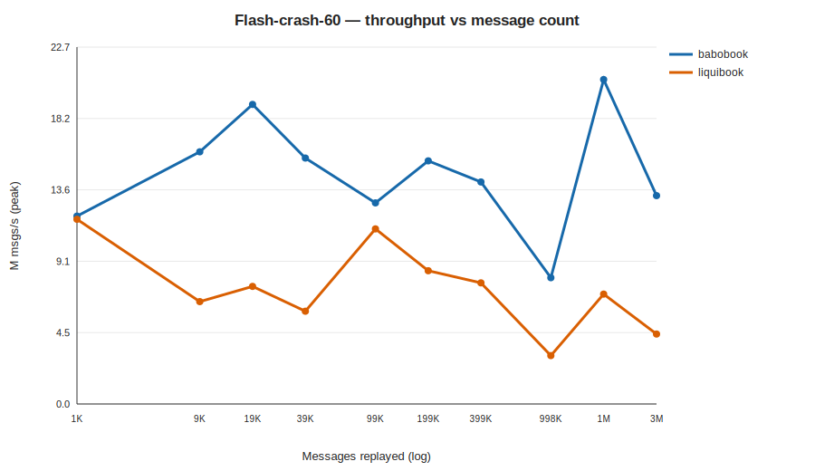

<!-- GENERATED by scripts/run_market_matrix.py; do not hand-edit. -->
# babobook vs liquibook — throughput across market regimes and scale

- **Label:** Linux-AMD Ryzen 9 5900HX
- **Generated (UTC):** 2026-07-14T13:41:36.410239+00:00
- **CPU / OS:** AMD Ryzen 9 5900HX with Radeon Graphics — Linux-6.17.0-14-generic-x86_64-with-glibc2.39
- **RAM / logical CPUs:** 30.7 GiB / 16
- **Compiler:** GNU 13.3.0 · build `Release`
- **Git:** `486d2fa8942fa47c4ce827c7d3afb754aa8b2d1a` (branch `main`, dirty `True`)
- **Protocol:** core-pinned perf binaries, no-op listener; 10 reps per cell, reporting **peak** (per-rep min / best); 1 warmup per cell.
- **Scale:** 1,000, 5,000, 10,000, 20,000, 50,000, 100,000, 200,000, 500,000, 1,000,000, 2,000,000 NEW orders (messages ≈ 2.25×).

## Normal

| NEW orders | Messages | babobook M/s | liquibook M/s | Speedup |
|---:|---:|---:|---:|---:|
| 1,000 | 1,993 | 11.90 | 11.94 | 1.00× |
| 5,000 | 9,983 | 16.80 | 6.40 | 2.63× |
| 10,000 | 19,957 | 17.06 | 6.68 | 2.56× |
| 20,000 | 39,878 | 14.67 | 5.51 | 2.66× |
| 50,000 | 99,955 | 15.40 | 8.85 | 1.74× |
| 100,000 | 199,833 | 15.19 | 8.42 | 1.80× |
| 200,000 | 399,176 | 18.78 | 6.98 | 2.69× |
| 500,000 | 998,097 | 9.53 | 2.93 | 3.25× |
| 1,000,000 | 1,996,097 | 17.06 | 5.61 | 3.04× |
| 2,000,000 | 3,992,943 | 11.36 | 2.08 | 5.46× |

## Swing-25

| NEW orders | Messages | babobook M/s | liquibook M/s | Speedup |
|---:|---:|---:|---:|---:|
| 1,000 | 1,993 | 11.89 | 11.91 | 1.00× |
| 5,000 | 9,983 | 16.80 | 6.45 | 2.60× |
| 10,000 | 19,957 | 18.28 | 7.08 | 2.58× |
| 20,000 | 39,878 | 15.06 | 5.59 | 2.69× |
| 50,000 | 99,955 | 15.54 | 9.18 | 1.69× |
| 100,000 | 199,833 | 15.23 | 8.34 | 1.83× |
| 200,000 | 399,176 | 14.32 | 7.46 | 1.92× |
| 500,000 | 998,097 | 8.01 | 3.01 | 2.66× |
| 1,000,000 | 1,996,097 | 18.64 | 6.05 | 3.08× |
| 2,000,000 | 3,992,943 | 11.75 | 3.98 | 2.96× |

## Swing-40

| NEW orders | Messages | babobook M/s | liquibook M/s | Speedup |
|---:|---:|---:|---:|---:|
| 1,000 | 1,993 | 11.89 | 11.95 | 0.99× |
| 5,000 | 9,983 | 16.48 | 6.45 | 2.56× |
| 10,000 | 19,957 | 18.23 | 7.08 | 2.57× |
| 20,000 | 39,878 | 15.29 | 5.72 | 2.67× |
| 50,000 | 99,955 | 15.38 | 9.33 | 1.65× |
| 100,000 | 199,833 | 15.30 | 8.47 | 1.81× |
| 200,000 | 399,176 | 14.20 | 7.57 | 1.88× |
| 500,000 | 998,097 | 7.94 | 3.02 | 2.63× |
| 1,000,000 | 1,996,097 | 19.43 | 6.19 | 3.14× |
| 2,000,000 | 3,992,943 | 12.52 | 4.26 | 2.94× |

## Flash-crash-60

| NEW orders | Messages | babobook M/s | liquibook M/s | Speedup |
|---:|---:|---:|---:|---:|
| 1,000 | 1,993 | 11.94 | 11.74 | 1.02× |
| 5,000 | 9,983 | 16.04 | 6.51 | 2.46× |
| 10,000 | 19,957 | 19.05 | 7.47 | 2.55× |
| 20,000 | 39,878 | 15.64 | 5.90 | 2.65× |
| 50,000 | 99,955 | 12.79 | 11.13 | 1.15× |
| 100,000 | 199,833 | 15.46 | 8.47 | 1.82× |
| 200,000 | 399,176 | 14.12 | 7.70 | 1.83× |
| 500,000 | 998,097 | 8.03 | 3.08 | 2.61× |
| 1,000,000 | 1,996,097 | 20.63 | 6.99 | 2.95× |
| 2,000,000 | 3,992,943 | 13.25 | 4.44 | 2.98× |

> `M msgs/s` is the peak of 10 reps (matching-core throughput, no report emission). Absolute rates vary by CPU/clock; the **speedup** column is the cross-machine-comparable figure.
