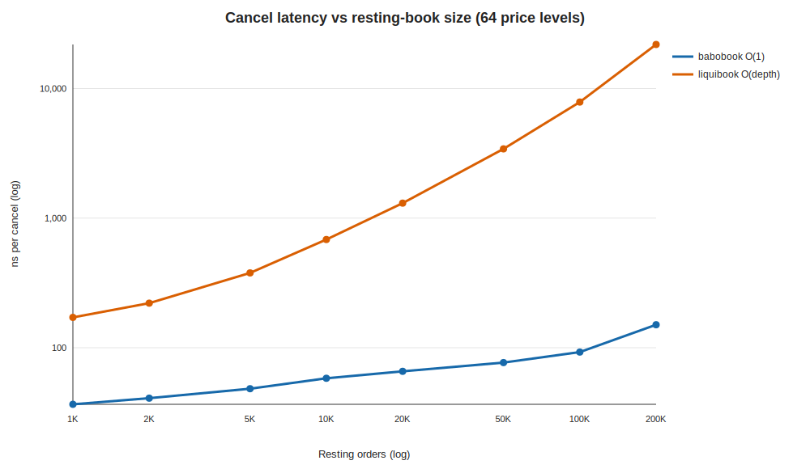

<!-- GENERATED by scripts/run_scaling.py; do not hand-edit. -->
# babobook vs liquibook — cancel latency vs resting-book size

- **Label:** Linux-AMD Ryzen 9 5900HX
- **Generated (UTC):** 2026-07-14T13:42:05.611010+00:00
- **CPU / OS:** AMD Ryzen 9 5900HX with Radeon Graphics — Linux-6.17.0-14-generic-x86_64-with-glibc2.39
- **Logical CPUs / RAM:** 16 / 30.7 GiB
- **Compiler:** GNU 13.3.0
- **CMake build type:** `Release`
- **Git:** `486d2fa8942fa47c4ce827c7d3afb754aa8b2d1a` (branch `main`, dirty `False`)
- **Setup:** 64 price levels; N orders → depth ≈ N/64; cancel all N in a fixed shuffled order; best of 3 reps; prefill off the clock.

| Resting N | Depth/level | babo ns/cancel | liquibook ns/cancel | babo cancel speedup |
|---:|---:|---:|---:|---:|
| 1,000 | 15 | 36.5 | 171.4 | 4.7× |
| 2,000 | 31 | 40.7 | 220.5 | 5.4× |
| 5,000 | 78 | 48.3 | 377.7 | 7.8× |
| 10,000 | 156 | 58.0 | 683.0 | 11.8× |
| 20,000 | 312 | 65.7 | 1305.2 | 19.9× |
| 50,000 | 781 | 76.7 | 3422.0 | 44.6× |
| 100,000 | 1,562 | 92.5 | 7867.3 | 85.1× |
| 200,000 | 3,125 | 150.3 | 21871.9 | 145.5× |

> babo cancel is O(1) (id→slot hash index); its gentle rise is cache-hierarchy latency as the working set outgrows L2/L3 — a cost liquibook pays too, on top of its O(depth) `find_on_market` rescan. The speedup column is the money figure.
