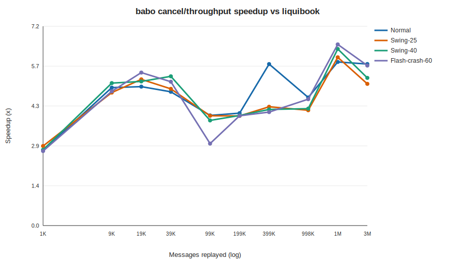
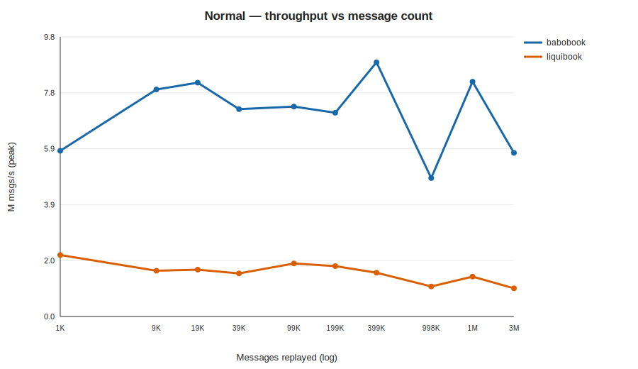
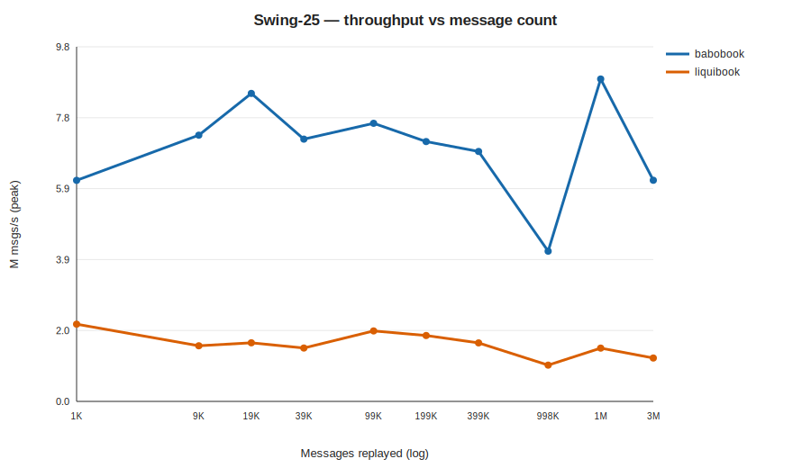
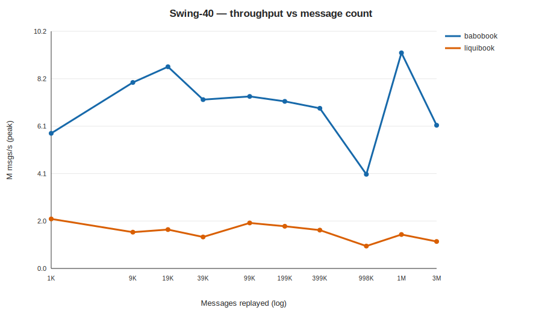
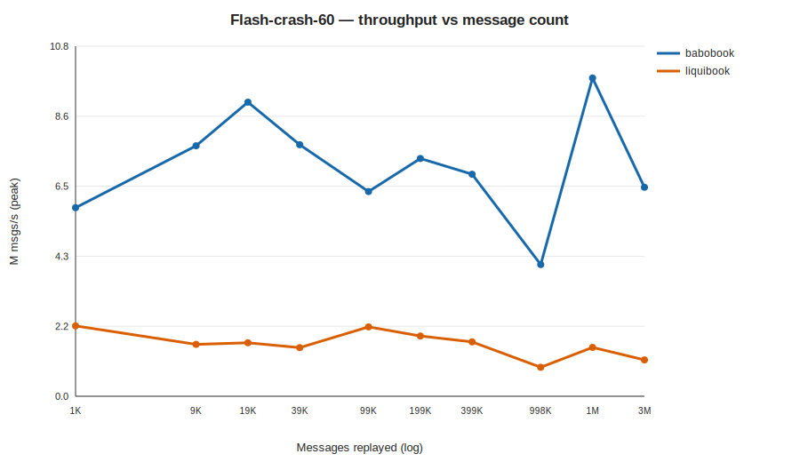

<!-- GENERATED by scripts/run_market_matrix.py; do not hand-edit. -->
# babobook vs liquibook — throughput across market regimes and scale

- **Label:** Windows-AMD Ryzen 7 7730U
- **Generated (UTC):** 2026-07-12T09:27:42.072349+00:00
- **CPU / OS:** AMD Ryzen 7 7730U with Radeon Graphics — Windows-11-10.0.26200-SP0
- **RAM / logical CPUs:** 13.84 GiB / 16
- **Compiler:** Clang 22.1.0 · build `Release`
- **Git:** `4ee60763d421accfea21f1003f7acd90002b11c1` (branch `main`, dirty `False`)
- **Protocol:** core-pinned perf binaries, no-op listener; 10 reps per cell, reporting **peak** (per-rep min / best); 1 warmup per cell.
- **Scale:** 1,000, 5,000, 10,000, 20,000, 50,000, 100,000, 200,000, 500,000, 1,000,000, 2,000,000 NEW orders (messages ≈ 2.25×).

## Normal

| NEW orders | Messages | babobook M/s | liquibook M/s | Speedup |
|---:|---:|---:|---:|---:|
| 1,000 | 1,993 | 5.78 | 2.14 | 2.70× |
| 5,000 | 9,983 | 7.92 | 1.60 | 4.96× |
| 10,000 | 19,957 | 8.16 | 1.63 | 5.00× |
| 20,000 | 39,878 | 7.24 | 1.50 | 4.81× |
| 50,000 | 99,955 | 7.33 | 1.85 | 3.96× |
| 100,000 | 199,833 | 7.11 | 1.76 | 4.04× |
| 200,000 | 399,176 | 8.87 | 1.53 | 5.81× |
| 500,000 | 998,097 | 4.83 | 1.05 | 4.61× |
| 1,000,000 | 1,996,097 | 8.19 | 1.39 | 5.88× |
| 2,000,000 | 3,992,943 | 5.71 | 0.98 | 5.81× |

## Swing-25

| NEW orders | Messages | babobook M/s | liquibook M/s | Speedup |
|---:|---:|---:|---:|---:|
| 1,000 | 1,993 | 6.11 | 2.13 | 2.86× |
| 5,000 | 9,983 | 7.35 | 1.54 | 4.78× |
| 10,000 | 19,957 | 8.51 | 1.62 | 5.26× |
| 20,000 | 39,878 | 7.24 | 1.47 | 4.92× |
| 50,000 | 99,955 | 7.68 | 1.95 | 3.95× |
| 100,000 | 199,833 | 7.18 | 1.82 | 3.94× |
| 200,000 | 399,176 | 6.90 | 1.62 | 4.27× |
| 500,000 | 998,097 | 4.15 | 1.00 | 4.15× |
| 1,000,000 | 1,996,097 | 8.90 | 1.47 | 6.05× |
| 2,000,000 | 3,992,943 | 6.11 | 1.20 | 5.10× |

## Swing-40

| NEW orders | Messages | babobook M/s | liquibook M/s | Speedup |
|---:|---:|---:|---:|---:|
| 1,000 | 1,993 | 5.81 | 2.13 | 2.73× |
| 5,000 | 9,983 | 8.00 | 1.56 | 5.12× |
| 10,000 | 19,957 | 8.67 | 1.67 | 5.18× |
| 20,000 | 39,878 | 7.26 | 1.35 | 5.37× |
| 50,000 | 99,955 | 7.40 | 1.96 | 3.78× |
| 100,000 | 199,833 | 7.19 | 1.81 | 3.96× |
| 200,000 | 399,176 | 6.89 | 1.65 | 4.18× |
| 500,000 | 998,097 | 4.05 | 0.96 | 4.21× |
| 1,000,000 | 1,996,097 | 9.27 | 1.46 | 6.35× |
| 2,000,000 | 3,992,943 | 6.16 | 1.16 | 5.31× |

## Flash-crash-60

| NEW orders | Messages | babobook M/s | liquibook M/s | Speedup |
|---:|---:|---:|---:|---:|
| 1,000 | 1,993 | 5.80 | 2.16 | 2.68× |
| 5,000 | 9,983 | 7.70 | 1.59 | 4.83× |
| 10,000 | 19,957 | 9.04 | 1.64 | 5.50× |
| 20,000 | 39,878 | 7.73 | 1.49 | 5.17× |
| 50,000 | 99,955 | 6.29 | 2.13 | 2.95× |
| 100,000 | 199,833 | 7.31 | 1.85 | 3.95× |
| 200,000 | 399,176 | 6.82 | 1.67 | 4.08× |
| 500,000 | 998,097 | 4.05 | 0.89 | 4.54× |
| 1,000,000 | 1,996,097 | 9.78 | 1.50 | 6.51× |
| 2,000,000 | 3,992,943 | 6.42 | 1.12 | 5.76× |

> `M msgs/s` is the peak of 10 reps (matching-core throughput, no report emission). Absolute rates vary by CPU/clock; the **speedup** column is the cross-machine-comparable figure.
