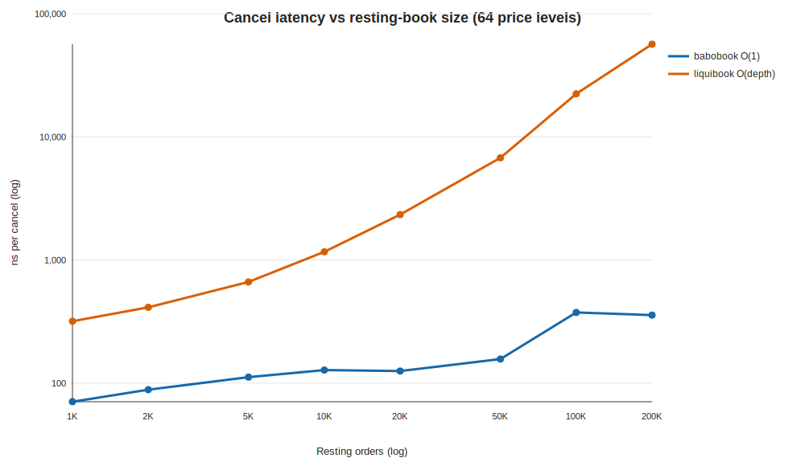

<!-- GENERATED by scripts/run_scaling.py; do not hand-edit. -->
# babobook vs liquibook — cancel latency vs resting-book size

- **Label:** Windows-AMD Ryzen 7 7730U
- **Generated (UTC):** 2026-07-12T09:29:27.444750+00:00
- **CPU / OS:** AMD Ryzen 7 7730U with Radeon Graphics — Windows-11-10.0.26200-SP0
- **Logical CPUs / RAM:** 16 / 13.84 GiB
- **Compiler:** Clang 22.1.0
- **CMake build type:** `Release`
- **Git:** `4ee60763d421accfea21f1003f7acd90002b11c1` (branch `main`, dirty `True`)
- **Setup:** 64 price levels; N orders → depth ≈ N/64; cancel all N in a fixed shuffled order; best of 3 reps; prefill off the clock.

| Resting N | Depth/level | babo ns/cancel | liquibook ns/cancel | babo cancel speedup |
|---:|---:|---:|---:|---:|
| 1,000 | 15 | 70.7 | 318.4 | 4.5× |
| 2,000 | 31 | 88.6 | 413.2 | 4.7× |
| 5,000 | 78 | 111.9 | 664.1 | 5.9× |
| 10,000 | 156 | 127.8 | 1167.5 | 9.1× |
| 20,000 | 312 | 125.5 | 2341.5 | 18.7× |
| 50,000 | 781 | 156.9 | 6765.6 | 43.1× |
| 100,000 | 1,562 | 375.6 | 22406.1 | 59.7× |
| 200,000 | 3,125 | 357.4 | 56672.4 | 158.6× |

> babo cancel is O(1) (id→slot hash index); its gentle rise is cache-hierarchy latency as the working set outgrows L2/L3 — a cost liquibook pays too, on top of its O(depth) `find_on_market` rescan. The speedup column is the money figure.
