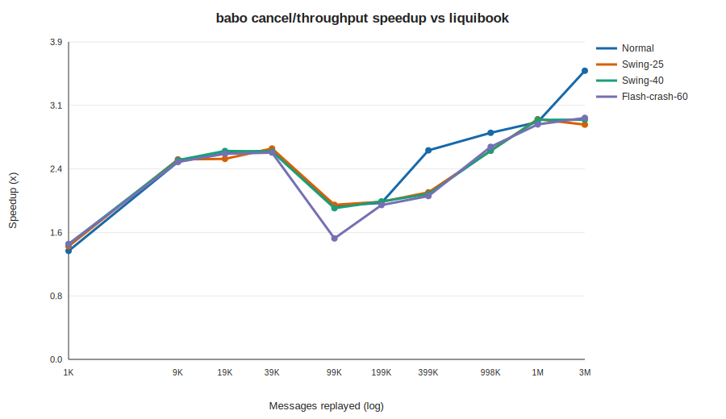
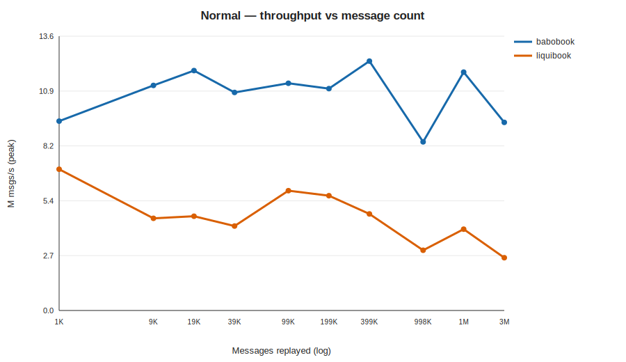
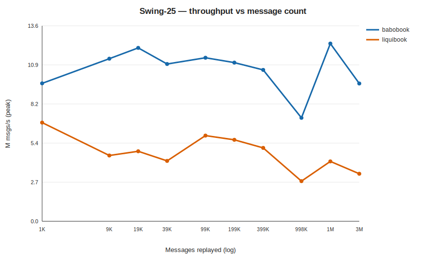
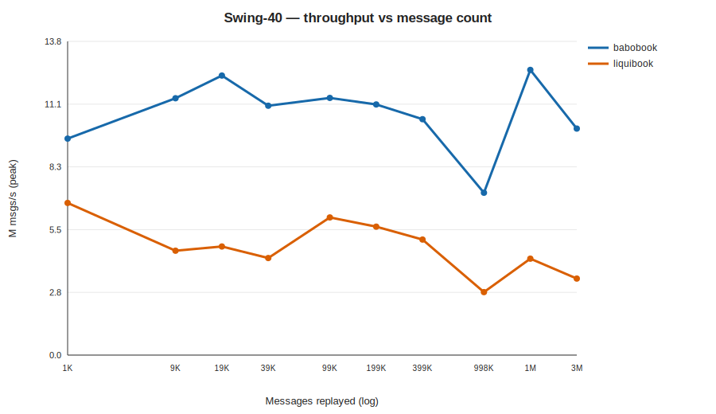
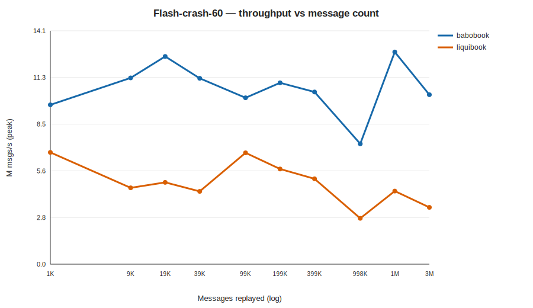

<!-- GENERATED by scripts/run_market_matrix.py; do not hand-edit. -->
# babobook vs liquibook — throughput across market regimes and scale

- **Label:** Windows-AMD Ryzen Threadripper PRO 3945WX 12-Cores
- **Generated (UTC):** 2026-07-16T15:31:28.526333+00:00
- **CPU / OS:** AMD Ryzen Threadripper PRO 3945WX 12-Cores — Windows-11-10.0.26200-SP0
- **RAM / logical CPUs:** 127.86 GiB / 24
- **Compiler:** Clang 17.0.6 · build `Release`
- **Git:** `486d2fa8942fa47c4ce827c7d3afb754aa8b2d1a` (branch `main`, dirty `False`)
- **Protocol:** core-pinned perf binaries, no-op listener; 10 reps per cell, reporting **peak** (per-rep min / best); 1 warmup per cell.
- **Scale:** 1,000, 5,000, 10,000, 20,000, 50,000, 100,000, 200,000, 500,000, 1,000,000, 2,000,000 NEW orders (messages ≈ 2.25×).

## Normal

| NEW orders | Messages | babobook M/s | liquibook M/s | Speedup |
|---:|---:|---:|---:|---:|
| 1,000 | 1,993 | 9.38 | 7.00 | 1.34× |
| 5,000 | 9,983 | 11.15 | 4.57 | 2.44× |
| 10,000 | 19,957 | 11.88 | 4.67 | 2.54× |
| 20,000 | 39,878 | 10.80 | 4.18 | 2.58× |
| 50,000 | 99,955 | 11.26 | 5.93 | 1.90× |
| 100,000 | 199,833 | 10.99 | 5.69 | 1.93× |
| 200,000 | 399,176 | 12.35 | 4.78 | 2.58× |
| 500,000 | 998,097 | 8.35 | 2.98 | 2.80× |
| 1,000,000 | 1,996,097 | 11.81 | 4.03 | 2.93× |
| 2,000,000 | 3,992,943 | 9.32 | 2.61 | 3.57× |

## Swing-25

| NEW orders | Messages | babobook M/s | liquibook M/s | Speedup |
|---:|---:|---:|---:|---:|
| 1,000 | 1,993 | 9.59 | 6.86 | 1.40× |
| 5,000 | 9,983 | 11.30 | 4.57 | 2.47× |
| 10,000 | 19,957 | 12.05 | 4.87 | 2.48× |
| 20,000 | 39,878 | 10.93 | 4.20 | 2.61× |
| 50,000 | 99,955 | 11.37 | 5.95 | 1.91× |
| 100,000 | 199,833 | 11.03 | 5.66 | 1.95× |
| 200,000 | 399,176 | 10.52 | 5.10 | 2.06× |
| 500,000 | 998,097 | 7.19 | 2.79 | 2.58× |
| 1,000,000 | 1,996,097 | 12.35 | 4.16 | 2.97× |
| 2,000,000 | 3,992,943 | 9.58 | 3.30 | 2.90× |

## Swing-40

| NEW orders | Messages | babobook M/s | liquibook M/s | Speedup |
|---:|---:|---:|---:|---:|
| 1,000 | 1,993 | 9.55 | 6.72 | 1.42× |
| 5,000 | 9,983 | 11.34 | 4.61 | 2.46× |
| 10,000 | 19,957 | 12.34 | 4.79 | 2.57× |
| 20,000 | 39,878 | 11.01 | 4.28 | 2.57× |
| 50,000 | 99,955 | 11.35 | 6.08 | 1.87× |
| 100,000 | 199,833 | 11.06 | 5.67 | 1.95× |
| 200,000 | 399,176 | 10.41 | 5.10 | 2.04× |
| 500,000 | 998,097 | 7.17 | 2.78 | 2.58× |
| 1,000,000 | 1,996,097 | 12.59 | 4.25 | 2.96× |
| 2,000,000 | 3,992,943 | 10.00 | 3.38 | 2.96× |

## Flash-crash-60

| NEW orders | Messages | babobook M/s | liquibook M/s | Speedup |
|---:|---:|---:|---:|---:|
| 1,000 | 1,993 | 9.62 | 6.75 | 1.43× |
| 5,000 | 9,983 | 11.25 | 4.61 | 2.44× |
| 10,000 | 19,957 | 12.54 | 4.94 | 2.54× |
| 20,000 | 39,878 | 11.22 | 4.39 | 2.55× |
| 50,000 | 99,955 | 10.05 | 6.72 | 1.49× |
| 100,000 | 199,833 | 10.95 | 5.75 | 1.91× |
| 200,000 | 399,176 | 10.40 | 5.15 | 2.02× |
| 500,000 | 998,097 | 7.27 | 2.77 | 2.63× |
| 1,000,000 | 1,996,097 | 12.81 | 4.41 | 2.90× |
| 2,000,000 | 3,992,943 | 10.23 | 3.43 | 2.98× |

> `M msgs/s` is the peak of 10 reps (matching-core throughput, no report emission). Absolute rates vary by CPU/clock; the **speedup** column is the cross-machine-comparable figure.
