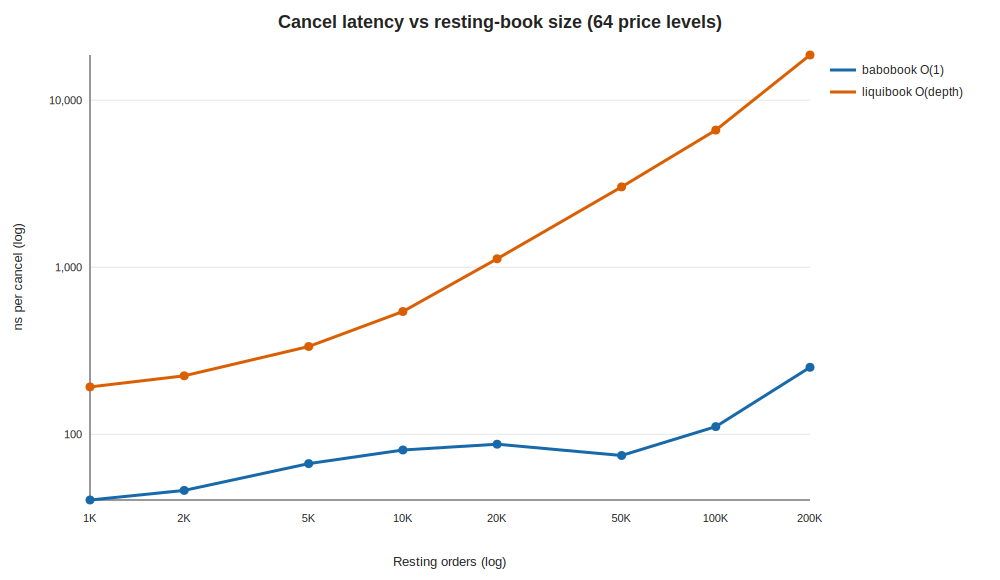

<!-- GENERATED by scripts/run_scaling.py; do not hand-edit. -->
# babobook vs liquibook — cancel latency vs resting-book size

- **Label:** Windows-AMD Ryzen Threadripper PRO 3945WX 12-Cores
- **Generated (UTC):** 2026-07-16T15:31:49.988006+00:00
- **CPU / OS:** AMD Ryzen Threadripper PRO 3945WX 12-Cores — Windows-11-10.0.26200-SP0
- **Logical CPUs / RAM:** 24 / 127.86 GiB
- **Compiler:** Clang 17.0.6
- **CMake build type:** `Release`
- **Git:** `486d2fa8942fa47c4ce827c7d3afb754aa8b2d1a` (branch `main`, dirty `True`)
- **Setup:** 64 price levels; N orders → depth ≈ N/64; cancel all N in a fixed shuffled order; best of 3 reps; prefill off the clock.

| Resting N | Depth/level | babo ns/cancel | liquibook ns/cancel | babo cancel speedup |
|---:|---:|---:|---:|---:|
| 1,000 | 15 | 40.4 | 192.0 | 4.8× |
| 2,000 | 31 | 46.1 | 223.8 | 4.9× |
| 5,000 | 78 | 66.7 | 335.2 | 5.0× |
| 10,000 | 156 | 80.5 | 543.4 | 6.8× |
| 20,000 | 312 | 87.2 | 1122.6 | 12.9× |
| 50,000 | 781 | 74.6 | 3025.1 | 40.6× |
| 100,000 | 1,562 | 111.0 | 6621.2 | 59.6× |
| 200,000 | 3,125 | 251.5 | 18640.3 | 74.1× |

> babo cancel is O(1) (id→slot hash index); its gentle rise is cache-hierarchy latency as the working set outgrows L2/L3 — a cost liquibook pays too, on top of its O(depth) `find_on_market` rescan. The speedup column is the money figure.
